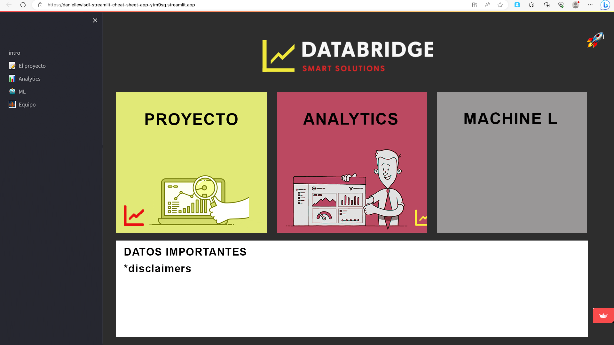

#  Google maps + Yelp! 🗺️ 🚀

## Contexto 🌍

La opinión de los usuarios se ha convertido en un dato invaluable en la planificación
de estrategias comerciales. Plataformas de reseñas como Yelp y
Google Maps proporcionan una gran cantidad de información sobre la
percepción de los usuarios respecto a diversos negocios, incluyendo restaurantes,
hoteles, esteticas y otros servicios relacionados. Esta retroalimentación
es esencial para las empresas, ya que les permite evaluar su desempeño,
identificar áreas de mejora y comprender cómo son percibidas por los
usuarios. Como parte de una consultora de data, se nos ha contratado para
realizar un análisis detallado de la opinión de los usuarios en Yelp y Google
Maps sobre negocios relacionados con el cuidado personal y la estetica en el
mercado estadounidense.
El rubro de belleza abarca una amplia gama de servicios y establecimientos
relacionados con el cuidado personal y la estética. Algunos ejemplos de negocios
dentro de este rubro son los salones de belleza, spas, peluquerías, barberías,
salones de uñas, centros de estética, salones de masajes y tiendas de
productos de belleza.

## Table of Contents

* [Descripcion + Objetivo](#descripcion-+-objetivo)
* [Demo](#demo)
* [Kpis](#kpis)
* [Tech Stack](#stack-tecnológico)
* [Metodologia + cronograma](#metodologia-+cronograma)
* [Modelo ER](#modelo-er)
* [Diccionario Datos](#diccionario-datos)
* [Visualizaciones](#visualizaciones)
* [Machine Learning](#machine-learning)
* [App usuario](#app-usuario)
* [Conclusiones](#conslusiones)
* [Equipo](#equipo)
* [Disclaimers](#disclaimer)

## Descripcion + Objetivo

Nuestro proyecto consiste en recopilar, depurar y analizar datos de reseñas de
Yelp y Google Maps, utilizando técnicas de análisis de sentimientos y machine
learning para determinar las ubicaciones más adecuadas para establecer
nuevos locales comerciales y descubrir oportunidades de inversión investigando
aspectos como el crecimiento del mercado, la demanda de servicios de
belleza, la competencia existente y las tendencias emergentes.
Con base en el análisis realizado, generaremos recomendaciones claras y fundamentadas
para el inversor. Estas recomendaciones mostrarán las oportunidades
de inversión más atractivas en el rubro de belleza, destacando los
aspectos clave que respaldan la viabilidad y el potencial de crecimiento de
cada oportunidad.
Aunque nos enfocaremos principalmente en el sector de estetica, la metodología
puede aplicarse a otros tipos de comercios.

**El objetivo principal del proyecto** es brindar a nuestro cliente: inversor de la
industria estetica latinoamericana una vision general del mercado estadounidense
con el fin de que tome las decisiones mas informadas e inteligentes
para incorporarse como competidor en dicho mercado. Gracias a un análisis
exhaustivo de la opinión de los usuarios en Yelp y Google Maps podremos
identificar tendencias, predecir el crecimiento o decaimiento de rubros
comerciales y tomar decisiones estratégicas informadas para mejorar
decisiones de gestion e inversion de negocios.

## Demo

Provide a screenshot or GIF of your application. Using a GIF is generally more pleasing as people can see in real time how the application works.

## Application Description

Descripcion de la aplicacion que generaremos en STREAMLIT

View the application at [Deployed Project Link](Link)

## Stack Tecnológico

      
  
     
      

         

  

## Metodología + Cronograma

Trabajamos siguiendo el **CRONOGRAMA** a continuación:

## Modelo ER

## Diccionario Datos

Yelp!

Estos conjuntos de datos proporcionan información sobre negocios, reseñas,
usuarios, horarios de check-in y consejos en Yelp.
"business.pkl": contiene información sobre negocios. Las columnas incluyen el
ID del negocio, nombre, dirección, ciudad, estado, código postal, latitud, longitud,
rating en estrellas, número de reseñas, estado de apertura, atributos del negocio,
categorías y horarios de atención.
"review.json": contiene reseñas completas. Las columnas incluyen el ID de la
reseña, ID único del usuario que la escribió, ID del negocio al que se refiere la
reseña, puntaje en estrellas, fecha, texto de la reseña y votos útiles, graciosos y
cool.
"user.parquet": contiene información sobre usuarios. Las columnas incluyen el ID
del usuario, nombre, número de reseñas escritas, fecha de creación de la cuenta,
lista de amigos, votos útiles, graciosos y cool recibidos, número de fans, años
como miembro elite, promedio de valor de las reseñas y totales de cumplidos recibidos
en diferentes categorías.
"checkin.json": registra los horarios de check-in en los negocios. Las columnas
incluyen el ID del negocio y una lista de fechas y horas de check-in.
"tip.json": contiene consejos escritos por los usuarios. Las columnas incluyen el
texto del consejo, fecha de escritura, cantidad de cumplidos recibidos, ID del negocio
al que se refiere e ID del usuario que lo escribió.

Google Maps

Estos conjuntos de datos proporcionan información detallada
sobre comercios y reseñas relacionadas con Google Maps.
"metadata_sitios": contiene información sobre comercios y sus atributos,
como el nombre, dirección, ubicación geográfica, categoría,
puntaje promedio, precios y horarios de atención.
"review-estados": contiene reseñas de usuarios organizadas por estados
de EE. UU.

## Visualizaciones 

POWER BI

-screen de un dashboard -

View the application at [Deployed Project Link](Link)

## Machine Learning

* Análisis de sentimientos: 

Aplicación de técnicas de procesamiento de lenguaje
natural (NLP) para analizar el sentimiento de las reseñas y clasificarlas
en positivas, negativas o neutrales. Utilizando la libreria SentimentIntensityAnalyzer del conjunto nltk.sentiment.

-screen de uso -

* Recomendación inversión: 

Predicción de tendencias: Desarrollo de modelos de machine learning,
supervisados o no supervisados, para predecir los rubros de los negocios que
experimentarán crecimiento o declive en base a las reseñas.

-screen de uso -

## App usuario

STREAMLIT APP

View the application at [Deployed Project Link](Link)

## Equipo

| Username   | Link ↘️                | Función |
|------------|-----------------------|------------|
| paupallares | github.com/paupallares | Analista funcional |
| BenJokek	| github.com/BenJokek | Data Engineer |
| cullanco-huaman | github.com/cullanco-huaman | Data Engineer | 
| claritzo | github.com/claritzo | Data Analyst | 
| GonzaloSchwerdt | github.com/GonzaloSchwerdt | ML Engineer | 

## Contributing

Provide instructions for other people on **how** to allow them to contribute to the project. These are guidelines they will have to follow if they want to contribute. The [Contributor Covenant](https://www.contributor-covenant.org/) is a good place to look at industry standard guidelines for others to follow.

Note: You can have a link to a CONTRIBUTING.md file if you have a long list of guidelines to follow 😄

## Disclaimer

Este material se proporciona únicamente con fines educativos. No se pretende ni se debe interpretar como asesoramiento legal, financiero o profesional de ningún tipo. La información contenida en este material es precisa y completa en la medida de nuestro conocimiento, pero no garantizamos su exactitud, integridad o actualidad.

El uso de este material es bajo su propio riesgo. No nos hacemos responsables de ningún daño, pérdida o inconveniente causado por el uso de este material.

Queda estrictamente prohibido el uso comercial de este material, ya sea total o parcialmente, sin nuestro consentimiento expreso por escrito. Cualquier reproducción, distribución o explotación con fines comerciales está estrictamente prohibida.

